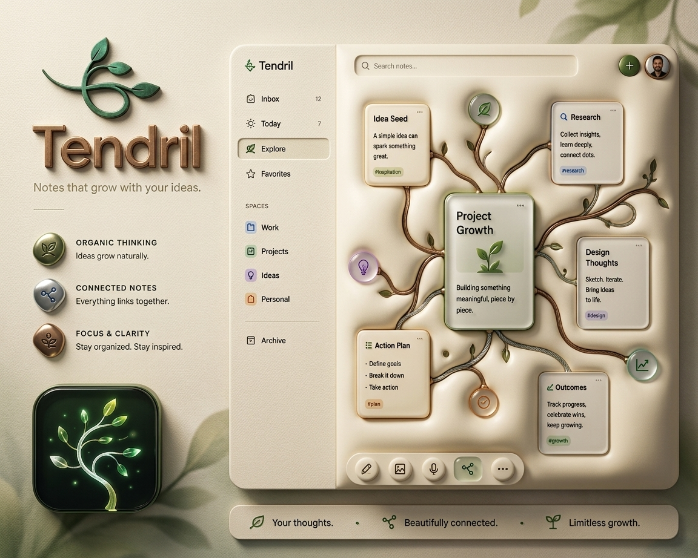
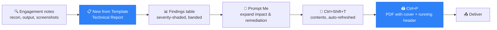
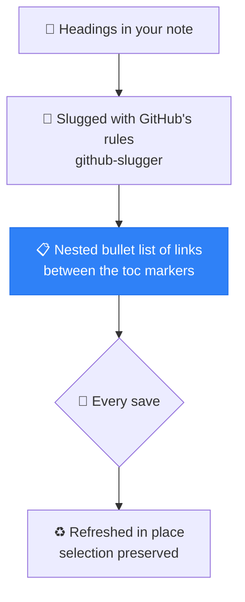
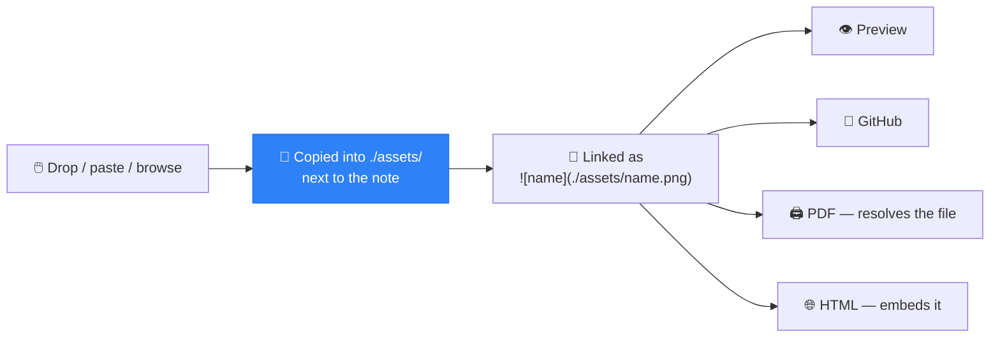
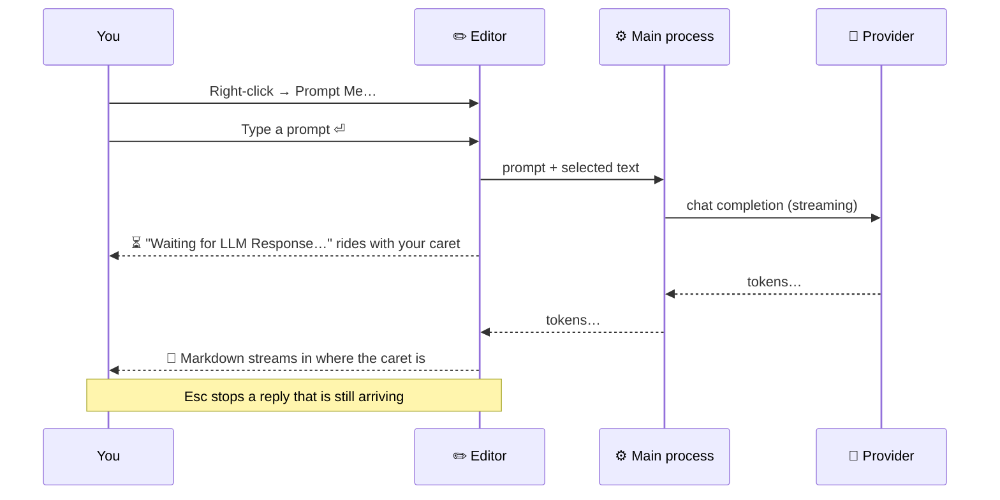
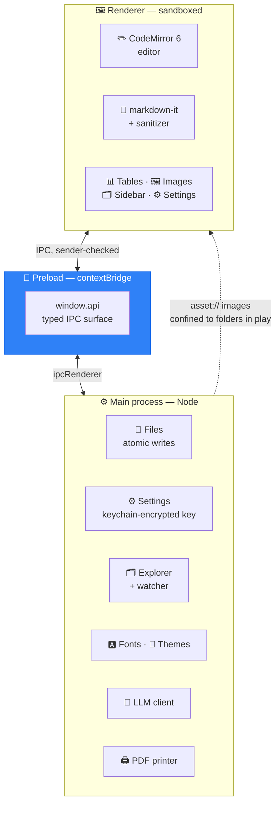
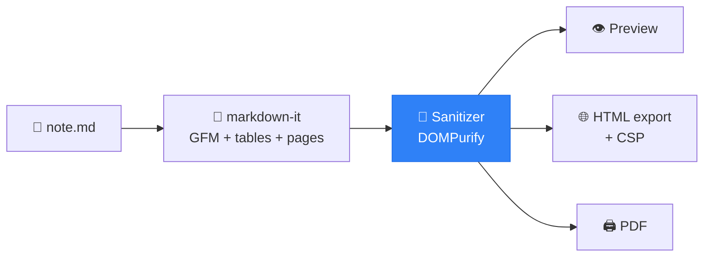

<div align="center">



# 🌿 Tendril

**A minimalist desktop Markdown editor with Word-like structure — that survives as plain text.**

📝 **Microsoft Word's document features + Obsidian's Markdown workflow, in one editor.**
Take notes the way you already do, then turn them into a **delivery-ready pentest report** — cover page,
linked contents, severity-shaded findings tables, running header, clickable PDF — without ever leaving Markdown
or opening Word. 🛡️

[](#-license)
[](#%EF%B8%8F-installation)
[](https://www.electronjs.org/)
[](https://www.typescriptlang.org/)
[](#-development)

</div>

---

## 📑 Contents

- [Why Tendril](#-why-tendril)
- [Features](#-features)
- [Built for pentest reports](#%EF%B8%8F-built-for-pentest-reports)
- [Installation](#%EF%B8%8F-installation)
- [Keyboard shortcuts](#%EF%B8%8F-keyboard-shortcuts)
- [The linked table of contents](#-the-linked-table-of-contents)
- [Tables, the Word way](#-tables-the-word-way)
- [Images](#%EF%B8%8F-images)
- [Explorer](#%EF%B8%8F-explorer)
- [Prompt Me — optional AI](#-prompt-me--optional-ai)
- [PDF & HTML export](#%EF%B8%8F-pdf--html-export)
- [Appearance](#-appearance)
- [Templates](#-templates)
- [Architecture](#%EF%B8%8F-architecture)
- [Security](#-security)
- [Development](#-development)
- [License](#-license)

---

## 💡 Why Tendril

Word gives you structure — a contents page, shaded table cells, a cover sheet — and locks
it in a binary file. Markdown gives you a plain-text file that lives happily in git, and
takes the structure away.

Tendril refuses the trade. **Everything it adds is written into the `.md` file as Markdown
that other tools already understand:**

```mermaid
flowchart LR
    A["✍️ You write<br/>in Tendril"] --> B["📄 note.md<br/>plain Markdown"]
    B --> C["🐙 GitHub<br/>renders it"]
    B --> D["📘 GitBook<br/>renders it"]
    B --> E["🌐 HTML export<br/>self-contained"]
    B --> F["🖨️ PDF export<br/>clickable TOC"]
    B --> G["🔀 git diff<br/>readable"]
    style B fill:#2f81f7,stroke:#1f6feb,color:#fff
```



The table of contents is a bullet list of links. Table shading is an HTML comment the app
manages for you. The front matter is YAML. Delete Tendril tomorrow and every file you wrote
still opens, still renders, still diffs. 🔓

### 🤝 The best of both worlds

Tendril is a deliberate merge of the features people actually use in each tool:

| 📝 Taken from **MS Word** | 🟣 Taken from **Obsidian** |
|---|---|
| Linked table of contents, refreshed automatically | Plain `.md` files in a plain folder — your vault stays yours |
| Word-style table grid: merge, shading, banded rows, alignment | Live preview that renders as you type |
| Cover page and title block from document properties | Fast file explorer with search |
| Running header / footer and "Page n of m" in the PDF | Community themes — import any Obsidian theme's palette |
| Print-quality export you can hand to a client | Paste a screenshot straight into the note |

...and nothing from either that locks the file. ✅

---

## ✨ Features

| | Feature | What it does |
|---|---|---|
| 🔗 | **Linked table of contents** | Written into the file between `<!-- toc -->` markers, refreshed on every save, GitHub-compatible anchors |
| 📊 | **Word-style tables** | Size-picker grid, right-click menu for merge, shading, alignment, banded rows — and it stays a valid GFM table |
| 🖼️ | **Images** | Drop, paste or browse; copied into an `assets/` folder next to the note and linked relatively |
| 🪟 | **Three views** | Edit, Split and Reading — plus optional in-place live preview while editing |
| ✏️ | **Multiple cursors** | Sublime-style: `Ctrl+D`, column carets, split selection into lines |
| 🗂️ | **File explorer** | AppFlowy-style sidebar with search, templates, trash and reveal-in-file-manager |
| 🤖 | **Prompt Me (optional AI)** | Inline prompt bar backed by a local LLM or OpenRouter — **off by default** |
| 🖨️ | **Real PDF export** | Print stylesheet, repeated table headers, running header/footer, document outline |
| 🌐 | **HTML export** | Self-contained single file, GitHub look, fonts embedded |
| 🎨 | **Themes & fonts** | Light/Dark/System, Obsidian theme import, Nerd Font download — no OS font install |
| ⌨️ | **Rebindable shortcuts** | Every shortcut, changed by pressing the new keys |
| 📋 | **Templates** | Notes and reports, plus your own folder of `.md` templates |
| 🛡️ | **Pentest-report ready** | Built-in report templates, severity-shaded findings tables, evidence screenshots, one-key PDF |
| 🔒 | **Hardened by default** | Sandboxed renderer, sanitized rendering, confined asset access ([details](#-security)) |

---

## 🛡️ Built for pentest reports

The whole feature set points at one workflow: **take engagement notes, then ship the
report from the same files.** No copy-paste into Word at 2 a.m., no screenshots that lose
their place, no contents page rebuilt by hand after the last finding lands.



### 📋 Start from a built-in report template

`Ctrl+Alt+N` → **Reports** → **Technical Report** gives you the skeleton a pentest report
needs, already wired up:

```
📄 Cover page        title, author, date, organisation — styled, its own page
📑 Contents          a <!-- toc --> block that refreshes on every save
📃 Page break        the body starts on a fresh page
📝 Abstract          → your Executive Summary
🔬 Method            → Scope & Methodology
📊 Results           → Findings
💬 Discussion        → Risk & Remediation
📚 References        → CVEs, advisories, tooling
```

The headings are ordinary Markdown — rename them to your own methodology and the contents
block follows. Save the result into your templates folder (**Settings › Templates**) and
your house format shows up in the picker for every engagement afterwards. 🏷️

### 📊 Findings tables that look like Word

Severity colours are a right-click away — **Shading ▸** on the cell — and the table stays a
valid GFM table that still renders on GitHub:

```markdown
<!-- table: banded -->
| # | Finding | Severity | CVSS | Status |
|---|---|---|---|---|
| 1 | SMB signing not required | <!--bg:#c00000 fg:#ffffff-->Critical | 9.1 | Open |
| 2 | TLS 1.0 still enabled    | <!--bg:#ffc000-->Medium              | 5.3 | Open |
| 3 | Verbose error pages      | <!--bg:#548235 fg:#ffffff-->Low      | 3.1 | Fixed |
```

🦓 **Banded rows**, merged cells, per-column alignment and wrap control — the Word table
menu, on a Markdown table. In the PDF the header row repeats on every page, so a findings
table that runs long is still readable. 📄

### 🖼️ Evidence, in place

**Paste a screenshot straight from the clipboard** (`Ctrl+V` after a screen grab) and it is
copied into the `assets/` folder next to the note and linked relatively — so the whole
engagement folder is self-contained, moves as one, and commits to git as one. 📸

### 🤖 Let the model write the boilerplate

Select a finding, right-click → **Prompt Me…**, and ask for the part nobody enjoys writing:

> *"Write an impact paragraph and remediation steps for this finding, for a bank's
> infrastructure team."*

The reply streams in as Markdown at your caret. Point it at a **local LLM** (Ollama, LM
Studio, llama.cpp) and **client data never leaves your machine** — which is usually the only
answer scope allows. 🔒 See [Prompt Me](#-prompt-me--optional-ai).

---

## ⬇️ Installation

Builds are **single files — no installer, no admin rights.** Grab one from the
[Releases page](https://github.com/csnakke/tendril/releases).

### 🐧 Linux — `.AppImage`

```bash
# Needs libfuse2 on modern distros (Ubuntu 22.04+, Fedora, …)
sudo apt install libfuse2t64          # Debian / Ubuntu - 64Bit
chmod +x Tendril-0.1.0-linux-x86_64.AppImage
./Tendril-0.1.0-linux-x86_64.AppImage
```

On first launch the app registers its own desktop entry and file-manager thumbnails under
`~/.local/share`, so it shows up in your launcher with a proper icon. 🎯

### 🪟 Windows — portable `.exe`

Download `Tendril-0.1.0-win-x64.exe` and double-click it. Nothing is installed; delete the
file to remove the app. SmartScreen may warn on an unsigned binary — *More info → Run anyway*.

### 🍎 macOS — `.zip`

Unzip and drag `Tendril.app` to Applications. The build is **unsigned**, so the first launch
needs **right-click → Open** (double-clicking shows "unidentified developer").

### 🔨 Build from source

```bash
git clone https://github.com/csnakke/tendril.git
cd tendril
npm install            # ⚠️ required first — nothing else works without it
```

Then pick what you want to do:

```bash
npm run dev            # hot-reloading development app
npm test               # unit tests
npm run typecheck      # tsc --noEmit, strict
npm run compile        # build main/preload/renderer → out/
npm run build:linux    # → dist/Tendril-<version>-linux-x86_64.AppImage
npm run build:win      # → dist/Tendril-<version>-win-x64.exe
npm run build:mac      # → dist/Tendril-<version>-mac-<arch>.zip
```

> **Requirements:** Node.js 20.19+ (or 22.12+) and npm.

### 🩹 Troubleshooting

| Symptom | Cause | Fix |
|---|---|---|
| `sh: 1: electron-vite: not found` | `npm run build`/`compile` before installing | Run **`npm install`** first |
| `Cannot find module …` | Half-finished or stale install | `rm -rf node_modules && npm ci` |
| Electron aborts with a **SUID sandbox** error on Linux | Dev-machine `chrome-sandbox` permissions | `npx electron --no-sandbox .`, or `sudo chown root:root node_modules/electron/dist/chrome-sandbox && sudo chmod 4755 …` |
| The AppImage will not start | Missing FUSE | `sudo apt install libfuse2` |

---

## ⌨️ Keyboard shortcuts

Every shortcut below can be changed in **Settings › Keybindings** — click a shortcut, press
the new keys, `↺` restores the default. On macOS read `Ctrl` as `⌘`.

### 📁 File

| Action | Shortcut |
|---|---|
| New | `Ctrl+N` |
| New from Template… | `Ctrl+Alt+N` |
| Open… | `Ctrl+O` |
| Save | `Ctrl+S` |
| Save As… | `Ctrl+Shift+S` |
| Export to PDF… | `Ctrl+P` |
| Export HTML… | *Export button / File menu* |
| Settings | `Ctrl+,` |

### 👁️ View

| Action | Shortcut |
|---|---|
| Toggle Edit / Reading | `Ctrl+E` |
| Edit / Split / Reading | `Ctrl+1` / `Ctrl+2` / `Ctrl+3` |
| Toggle sidebar | `Ctrl+B` |
| Live preview in Edit view | `Ctrl+Shift+E` |

### ✏️ Editing

| Action | Shortcut |
|---|---|
| Insert / remove table of contents | `Ctrl+Shift+T` |
| Insert table (size grid) | `Ctrl+Alt+T` |
| Insert image | `Ctrl+Alt+I` |
| Next cell / previous cell (in a table) | `Tab` / `Shift+Tab` |

### 🖱️ Multiple cursors

| Action | Shortcut |
|---|---|
| Add a caret | `Ctrl+click` (or `Alt+click`) |
| Add the next occurrence of the selection | `Ctrl+D` |
| Split selection into lines *(single line: select every match)* | `Ctrl+Shift+L` |
| Add a caret above / below | `Ctrl+Alt+↑/↓` or `Ctrl+Shift+↑/↓` |
| Back to one caret | `Esc` |

> 💡 The `Ctrl+Shift+↑/↓` variants exist because GNOME grabs `Ctrl+Alt+arrows` for workspaces.

---

## 🔗 The linked table of contents

Press `Ctrl+Shift+T` (or the **TOC** button) and a contents list appears at your cursor,
between two HTML comments:

```markdown
<!-- toc -->
- [Getting started](#getting-started)
  - [Installing](#installing)
  - [First run](#first-run)
- [Configuration](#configuration)
<!-- tocstop -->
```



- 📏 Covers **H2–H3** by default — the same depth Word's contents field uses.
- 🔄 **Refreshed on every save**, so it never drifts from the document.
- 🐙 Anchors follow **GitHub's slug rules** (including the `-1`, `-2` suffixes for duplicate
  headings), so the links work unchanged on GitHub and GitBook.
- 🚫 A heading called *Contents* or *Table of Contents* is never listed in itself.
- ↩️ Press `Ctrl+Shift+T` again to remove it.

---

## 📊 Tables, the Word way

If you know Word's table tools, you already know these. **Table** in the toolbar (or
`Ctrl+Alt+T`, or right-click) opens **Word's size grid** — hover to pick columns × rows, or
type the numbers. Right-click *inside* a table for the full menu:

| | Menu item | |  | Menu item |
|---|---|---|---|---|
| ➕ | **Insert ▸** row / column | | 🎨 | **Shading ▸** (Office palette or any colour) |
| ➖ | **Delete ▸** row / column / table | | 🖍️ | **Font Colour ▸** |
| 🔗 | **Merge and Center** | | ↔️ | **Align Column ▸** |
| ✂️ | **Split Cells** | | 🦓 | **Banded Rows** / **Wrap Text** |

What GFM cannot express is written as HTML comments the app manages for you:

```markdown
<!-- table: banded nowrap -->
| Region | Q1 | Q2 |
|---|---|---|
| <!--bg:#ffc000 span:2x1-->North | 12 | 14 |
```

Marker keys are `bg`, `fg`, `span:CxR` and `align`; table options are `banded` and `nowrap`.
You never type them — the menu writes them — but they are readable, greppable and yours.

These are **hidden in live preview** and applied in the preview, HTML and PDF. The table
stays a valid GFM table, so GitHub and GitBook show it plain — no colours, merged cells
appear as empty ones. ✅

| | Word table feature | In Tendril |
|---|---|---|
| 🦓 | Banded rows | **Banded Rows** toggle — alternating fill in preview, HTML and PDF |
| 🎨 | Cell shading | **Shading ▸** — Office palette or any colour |
| 🔗 | Merge & centre | **Merge and Center** / **Split Cells** |
| ↔️ | Column alignment | **Align Column ▸** left / centre / right |
| 📄 | Header row repeats across pages | Automatic in PDF export |
| ↩️ | Wrap text | **Wrap Text** toggle (`nowrap` keeps cells on one line) |
| ⌨️ | `Tab` to the next cell, new row at the end | Same |

---

## 🖼️ Images

**Image** in the toolbar (`Ctrl+Alt+I`, or right-click → *Insert Picture…*) opens a drop zone
with a Browse button. You can also **drag an image straight into the editor** or **paste one
from the clipboard**. 📥



- 📂 The assets folder name is configurable in **Settings › Images** (default `assets`).
- 💾 An unsaved note is saved first, so the relative link has somewhere to point.
- 🤝 When a folder already has an assets folder, you are asked **once per session** whether to
  use it or pick another.

---

## 🗂️ Explorer

The sidebar (`Ctrl+B`) is an AppFlowy-style file tree:

- 🔍 **Search box** filters the tree by file name
- 📝 **New note** creates a note from a template in the current folder
- 📌 The **folder name heads the tree** — click to fold; its `⌄` menu goes to the parent, Home,
  any folder, or refreshes
- 🎯 Open files show the theme's highlight
- 🖱️ **Right-click** a file or folder for *Reveal in File Manager* and *Move to Trash*
- 🗑️ The **Trash** button at the bottom opens the system trash

> ⚠️ *Move to Trash* uses the real OS trash and the tree lists dotfiles too — mind the
> `.git` folder when you are browsing a repository.

---

## 🤖 Prompt Me — optional AI

Right-click in the editor → **Prompt Me…** for a one-line prompt bar at the cursor. It is
there to write the parts of a report that are the same every time — **impact paragraphs,
remediation steps, executive summaries, a plain-English gloss on tool output** — from the
finding you already wrote. ✍️



- ⏳ While the model thinks, a **waiting marker follows your caret** — move the cursor and it
  comes along; the reply lands wherever the caret is when the first token arrives.
- 📎 Any **selected text is sent along as context** and stays in place.
- ⚙️ **Settings › AI** picks the provider:
  - 🏠 **Local LLM** — any OpenAI-compatible server (Ollama, LM Studio, llama.cpp) by base URL
    and model name. **Nothing leaves your machine**, which is what an engagement's scope
    usually requires when the note holds client data 🔐
  - ☁️ **OpenRouter** — API key and model id, when the material is not sensitive and you want
    a bigger model
- ✅ **Test** checks the connection *and* that the model exists.
- 🔐 **Off by default.** The OpenRouter key is stored in the app's `settings.json`, encrypted
  with the OS keychain where one is available, used only from the main process, and **never
  read back into the window** — Settings shows that a key is saved and offers **Remove**.

---

## 🖨️ PDF & HTML export

**Export › Export to PDF…** prints the note as a *document*, not as a web page:

- 📐 An **11pt print stylesheet** — headings kept with their text, code that wraps instead of
  clipping, captioned figures from image titles
- 🔁 **Tables repeat their header row** on every page
- 📰 A **title block** built from the front matter (author · date, other properties as a meta
  line) — or the report's own **cover page**
- 🔖 The TOC as a **"Contents" block**, clickable, plus a real **PDF outline**
- 🏃 A **running header** (title, date) and **"Page n of m"** in the footer

**Settings › Export** sets paper size (A4 / Letter), body text face (editor font, sans or
serif — code always uses the editor font) and whether the header and footer are printed.

**HTML export** keeps the GitHub look, embeds images and fonts, and is a **single
self-contained file** you can mail to anyone. 📤

---

## 🎨 Appearance

The window is **frameless with a rounded boundary**. Drag the toolbar to move, double-click
it to maximize, `☰` opens the menu, and the `–`/`□`/`✕` controls sit top-right.

**Settings › Appearance** offers:

| | Setting | Options |
|---|---|---|
| 🌗 | Theme | Light / Dark / System |
| 🖌️ | Window border | Any colour, or "Theme default" |
| 🔤 | Interface font | Any installed family, or a downloaded Nerd Font |
| ⌨️ | Editor & preview font | Same, Mono variant |
| 🧩 | Icon set | Lucide / Tabler / Phosphor |

### 🅰️ Nerd Fonts, without installing them

Type a [Nerd Font](https://www.nerdfonts.com) name in the search box and press Enter: the zip
is downloaded from the official GitHub release, unpacked into the app's data folder
(`fonts/`), and selected — Propo variant for the interface, Mono for the editor. **No OS font
install, no admin rights.** The editor font is embedded in PDF exports and base64-embedded in
HTML exports (~2–3 MB per face), so they look identical anywhere. 📦

### 🌈 Obsidian themes

Tendril reads the Obsidian community theme catalogue and extracts a palette from any theme's
`theme.css`. Only the CSS custom properties on `:root` / `body` / `.theme-light` /
`.theme-dark` are used — every other rule targets Obsidian's own DOM and is discarded.

---

## 📋 Templates

`Ctrl+Alt+N` (or **New from Template…**) opens the picker, with a live preview:

| 📝 Notes | 📊 Reports |
|---|---|
| Note, Daily, Meeting | **Technical Report**, Academic, Proposal, Minutes |

Every report template ships with a **styled cover page**, `{{date}}` formatting, page breaks
and tables ready to fill in — **Technical Report** is the one to start a pentest report from
([workflow](#%EF%B8%8F-built-for-pentest-reports)). 🛡️

Placeholders are filled in as the note is created:

| Placeholder                           | Becomes                                                                      |
| ------------------------------------- | ---------------------------------------------------------------------------- |
| `{{title}}`                           | The title typed in the picker (also the file name)                           |
| `{{author}}`                          | **Settings › Templates › Author**                                            |
| `{{date}}` · `{{time}}`               | `2026-09-22` · `21:15`                                                       |
| `{{date:FORMAT}}` · `{{time:FORMAT}}` | Any format, e.g. `{{date:dddd, D MMMM YYYY}}` → *Tuesday, 21 September 2026* |
| `{{filename}}`                        | The file name without `.md`                                                  |
| `{{cursor}}`                          | Removed — the caret lands here                                               |

📅 Format tokens: `YYYY` `YY` `MMMM` `MMM` `MM` `M` `DD` `D` `dddd` `ddd` `HH` `mm` `ss`.
Anything Tendril does not recognise (`{{foo}}`) is left exactly as written.

### 📦 The `templates/` starter pack

This repository ships a **[`templates/`](templates/) folder** — two heavily commented
reference documents that double as working templates and as the documentation for what a
Tendril document can contain:

| File | Kind | What it demonstrates |
|---|---|---|
| [`Notes.md`](templates/Notes.md) | 📝 Note | Front matter of **every property type** (text, number, boolean → checkbox, list → tags, URL → link), every placeholder, and every Markdown feature Tendril renders — formatting, lists, tasks, tables, code, images, quotes |
| [`Reports.md`](templates/Reports.md) | 📊 Report | A full report skeleton: styled **cover page**, `@page` rules, contents block, page breaks, findings tables, a raw-HTML signature table, checklists and an appendix explaining the markers |
| [`README.md`](templates/README.md) | 📖 Docs | The template author's reference: placeholders, front matter, layout markers, useful CSS selectors |

**To use them:** point **Settings › Templates › Templates folder** at this folder (or copy
the files into your own), and both appear under `Ctrl+Alt+N` — and in the explorer's
right-click *New from Template Here…*. 🏷️

### 🧩 Report layout markers

What makes a document a *report* rather than a note — and what you can put in your own:

| Marker | Effect |
|---|---|
| `<!-- cover -->` … `<!-- /cover -->` | A **cover page** on its own sheet, contents vertically centred |
| `<!-- pagebreak -->` | Start a new page |
| `<style> … </style>` | **Document CSS**, scoped to the body — except `@page` and `@font-face`, which stay global so they can control the printed sheet |

Markers must sit at the start of a line at top level (not inside a list or a quote). 📐
A document using any of the three is previewed as **A4 sheets** and exported with the
running header and *Page n of m* footer.

Handy selectors for the `<style>` block: `.cover`, `.cover h1`, `.page`, `h1`…`h6`, `table`,
`blockquote`, `pre`, `.properties`.

### 📁 Your own templates

Every `.md` file in the templates folder is offered in *New from Template*, marked *yours*.
Files using `<!-- cover -->`, `<!-- pagebreak -->` or a `<style>` block are listed as
**reports**, the rest as **notes** — or sort them yourself into `notes/` and `reports/`
subfolders to force the kind.

---

## 🏗️ Architecture

Electron, TypeScript (strict), CodeMirror 6 and markdown-it — no UI framework, ~9k lines.



**How a note becomes output:**



---

## 🔒 Security

A `.md` file is a file like any other — it can come from anyone. Tendril is built on that
assumption:

| | Measure |
|---|---|
| 🧼 | **Everything rendered from Markdown is sanitized** (DOMPurify) — scripts, frames, event handlers and `javascript:` links are removed, in preview *and* in exports |
| 📜 | **Exported HTML carries its own CSP**, because the browser that opens it has none |
| 🏖️ | The **renderer keeps the OS sandbox**; `contextIsolation` on, `nodeIntegration` off |
| 🚪 | **Every IPC channel verifies** the call comes from the app's own frame |
| 🖼️ | **`asset://` serves image files from the folders in play** — where notes have been opened or saved, what you picked in a dialog, your own files — not the whole disk |
| 🔐 | The **OpenRouter key never enters the renderer**; it is encrypted at rest with the OS keychain |
| 📦 | The **font unpacker writes each `.ttf`/`.otf` as `dir/<basename>`** and skips symlink entries, so an archive entry cannot name a path |
| 🚫 | Debug hooks that run code in the page are **refused in packaged builds** |
| 🎨 | A note's own `<style>` block is kept — CSS runs nothing — and imported themes are stripped to colour variables |

Found something? Please open an issue. 🐛

---

## 🧑‍💻 Development

```bash
npm install
npm run dev          # hot-reloading app
npm test             # 94 unit tests (vitest)
npm run typecheck    # tsc --noEmit, strict
npm run compile      # build main/preload/renderer into out/
npm run build:linux  # | build:win | build:mac → dist/
```

### 🗺️ Project layout

```
src/
├── main/          ⚙️  Electron main — files, settings, explorer, fonts, themes, LLM, PDF
│   ├── index.ts       window, menu, IPC, asset:// scheme, AppImage integration
│   ├── fsx.ts         atomic writes
│   ├── settings.ts    settings.json + keychain-encrypted key
│   └── llm.ts         OpenAI-compatible streaming client
├── preload/       🌉  contextBridge — the typed window.api surface
├── renderer/      🖼️  the whole UI
│   ├── markdown.ts    markdown-it pipeline, HTML/PDF document shells
│   ├── sanitize.ts    the sanitizer every rendered note passes through
│   ├── toc.ts         TOC build / insert / refresh
│   ├── tables/        model, editor, context menu, size picker
│   ├── themes/        builtin palettes, Obsidian import
│   └── templates/     built-in note and report templates
├── shared/        ⌨️  keybinding definitions shared by both processes
└── tests/         ✅  pure-logic unit tests

templates/         📦  starter pack: Notes.md, Reports.md and their reference README
icons/             🎨  application icon and the image at the top of this file
scripts/           🔧  build helpers (AppImage thumbnails, Obsidian theme pre-import)
```

### 🧭 Notes for contributors

- **Edge/corner resizing is implemented in-app.** On native Wayland a window cannot
  reposition itself, so only the right, bottom and bottom-right handles are shown there;
  X11, Windows and macOS get all eight.
- **Anything a note can express must stay valid Markdown.** If a feature cannot survive a
  round-trip through GitHub's renderer, it does not belong in the file.

---

## 📄 License

[MIT](LICENSE) © csnakke

<div align="center">

**Made for people who want a document, and a plain text file, at the same time.** 🌿

</div>
